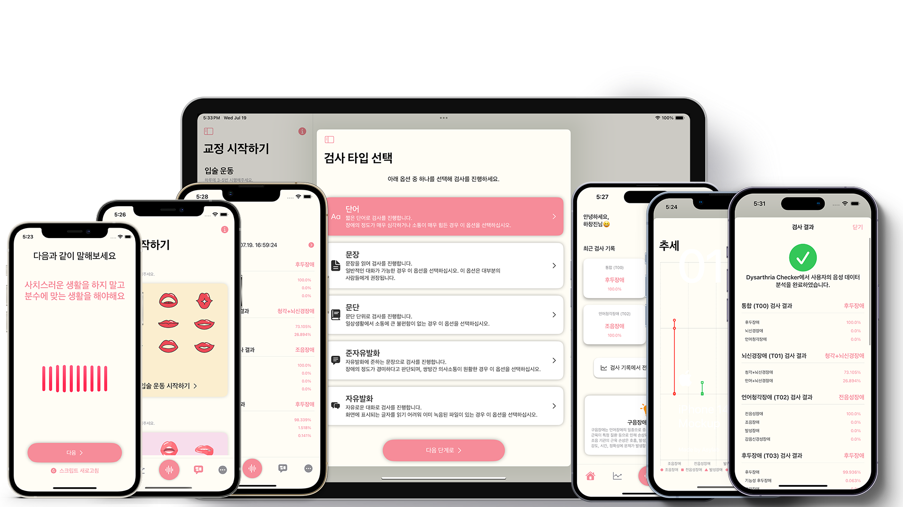

 
 

# Dysarthria Checker
### Diagnose your dysarthria with ML and Korean vocalization for Korean 
##### [Changjin Ha, Taesik Go. "Development of a Mobile Application for Disease Prediction Using Speech Data of Korean Patients with Dysarthria" Journal of Biomedical Engineering Research 45.1 (2024): 1-9](https://www.kci.go.kr/kciportal/ci/sereArticleSearch/ciSereArtiView.kci?sereArticleSearchBean.artiId=ART003057725)  

> #### Introduction
|Classes|Detection|
|-------|---------|
|Universal (T00)|Detect who is contained in T01, T02, T03|
|Brain (T01)|Detect language disorder, deafness|
|Language (T02)|Detect problem for Articulation, Vocalization, Conduction, Sensorineural|
|Larynx (T03)|Detect problem for Functional, Larynx, Oral|

 

> #### Model Accuracy
|Classes|Accuracy|
|-------|---------|
|Universal (T00)|0.9 (90%)|
|Brain (T01)|0.976 (97.6%)|
|Language (T02)|0.988 (98.8%)|
|Larynx (T03)|0.9 (90%)|

 

> #### Model Training Environment
|Category|Contents|
|--------|--------|
|CPU|Intel(R) Core(TM) i7-12700K|
|RAM|32GB|
|GPU|NVIDIA Geforce RTX 3060|
|Software|Python 3.9 CUDA 11.8 PyTorch 2.0.1|
